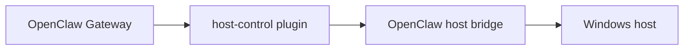

# host-control OpenClaw Plugin

This plugin exposes the host bridge as typed OpenClaw tools.

It exists so OpenClaw can work with host-PC operations through a narrow, explicit adapter instead of relying on generic shell execution or channel-specific hacks.

## Why this exists

- OpenClaw runtime lives in an isolated VM or container
- host-PC access is enforced by `openclaw-host-bridge`
- user-facing channels such as Telegram need predictable tool behavior

This plugin is the contract between OpenClaw and the bridge.

## Architecture role



The plugin translates assistant intent into typed bridge calls with explicit permission groupings and confirmation semantics.

## What the plugin does

It provides:

- bridge-backed OpenClaw tools
- confirmation policy handling
- path normalization and alias rewrites
- Telegram-friendly media results for file export and screenshots
- bridge and recovery client wiring

It does not own:

- host path enforcement
- audit logging
- channel rendering policy

Those responsibilities belong to the bridge and channel layers.

## Tool groups

Read-only by default:

- `host_control_health_check`
- `host_control_find_in_allowed_roots`
- `host_control_fs_list`
- `host_control_list_host_folder`
- `host_control_fs_search`
- `host_control_find_host_files`
- `host_control_fs_read_meta`

Hidden until `allowWriteOperations: true`:

- `host_control_fs_mkdir`
- `host_control_fs_move`

Hidden until `allowExportOperations: true`:

- `host_control_stage_for_telegram`
- `host_control_send_file_to_telegram`
- `host_control_capture_desktop_screenshot`
- `host_control_send_desktop_screenshot_to_telegram`

## Example config

```json
{
  "plugins": {
    "entries": {
      "host-control": {
        "enabled": true,
        "config": {
          "enabled": true,
          "bridgeUrl": "http://host.docker.internal:48721",
          "authTokenEnv": "OPENCLAW_HOST_BRIDGE_TOKEN",
          "timeoutMs": 10000,
          "allowWriteOperations": false,
          "allowExportOperations": false,
          "allowBrowserInspect": false
        }
      }
    }
  }
}
```

The bridge token should come from the environment variable named by `authTokenEnv`.

## Install

Use the managed installer path:

```bash
openclaw plugins install ./host-control-openclaw-plugin
```

That keeps plugin provenance under OpenClaw's normal install records instead of relying on ad hoc copies.

## Tests

Run:

```bash
node test/config.test.mjs
node test/tools.test.mjs
```

## Related repositories

- `openclaw-host-bridge`
- `openclaw-telegram-enhanced`
- `openclaw-runtime-distribution`